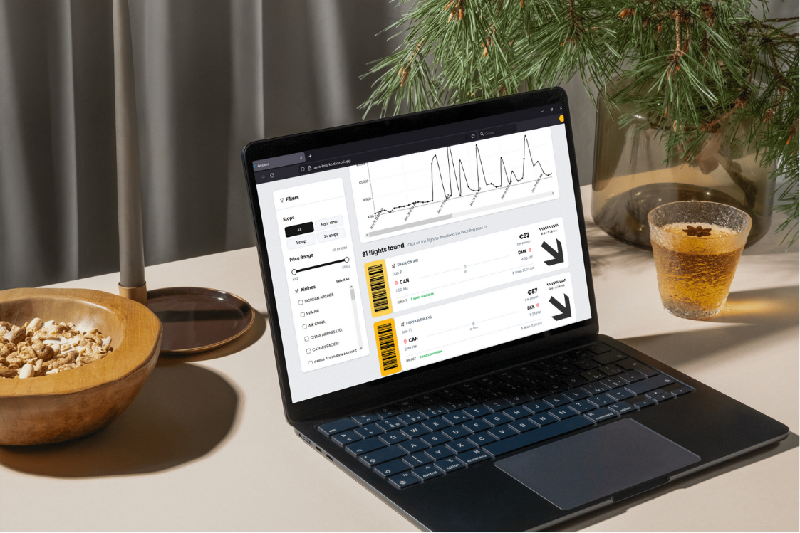

introducing

# Aerolens

**A web developer challenge · frontend position**

This project was rapidly prototyped using the Next.js framework for full-stack functionality, with Tailwind CSS and ShadCN-style components (Radix UI) for quick styling and responsiveness. Flight data is powered by the Amadeus API, with automatic fallback to mock data when the API is unavailable. Built with React Hook Form and Zod for form validation, Recharts for price visualization, and Axios for API calls.

**You can try for yourself here:** [https://aero-lens-kohl.vercel.app/](https://aero-lens-kohl.vercel.app/)

## Basic requirement checklist

- ✔️ A complete flight search experience. Built on a solid CSS foundation with Tailwind and component primitives. Designed to be scalable for future enhancement in both code and styling.
- ✔️ Full search and filter flow. You can filter by stops (non-stop, 1 stop, 2+), price range (slider), and airlines (multi-select). Filters reset after each new search. Data is sorted by departure time by default.
- ✔️ Live price graph
- ✔️ Fully responsive for various device sizes. Layout adapts from mobile to desktop;

## Non-functional requirement checklist

- 🎯 Graceful fallback. With Amadeus API integration, live data is used when credentials are set; otherwise mock data is served so the app always runs.
- 🎯 Fast, client-driven filtering. Stops, price, and airline filters run in the browser for instant updates without extra API calls.

## Additional enhancements

- ⭐ Sticky filter sidebar on desktop for persistent filters while scrolling through many results.
- ⭐ Interactive price trend chart (Recharts) with horizontal scroll for large result sets, tooltips, and configurable axis ticks.
- ⭐ Downloadable boarding-pass style image (PNG) per flight using html2canvas-pro. To ensure you will purchase the ticket sooner or later, or even post it to your instagram.
- ⭐ Loading and empty states with consistent card layout; error alert with dismiss.
- ⭐ Form validation (origin, destination, dates, travelers) with React Hook Form and Zod.
- ⭐ Catch-all 404 page and shared layout (navbar, footer) across main, loading, and not-found.
- ⭐ API route structure for flights search and location endpoints (airports, countries) ready for extension.

---

## Prerequisites

- Node.js 18+
- npm, yarn, pnpm, or bun
- Amadeus API credentials (optional—app uses mock data if unset or on API error)

## Installation

1. Clone the repository and navigate to the project directory:

   ```bash
   cd aerolens
   ```

2. Install dependencies:

   ```bash
   npm install
   ```

3. Set up environment variables (optional for mock data):

   - Copy `.env.example` to `.env.local`
   - Add Amadeus credentials for live API results:

   ```env
   AMADEUS_CLIENT_ID=your_client_id
   AMADEUS_CLIENT_SECRET=your_client_secret
   ```

   Get test credentials at [Amadeus for Developers](https://developers.amadeus.com/). Leave variables empty to use mock data.

4. Run the development server:
   ```bash
   npm run dev
   ```
   Open [http://localhost:3000](http://localhost:3000).

## Environment variables

| Variable                    | Description               | Required               |
| --------------------------- | ------------------------- | ---------------------- |
| `AMADEUS_CLIENT_ID`         | Amadeus API Client ID     | No (mock fallback)     |
| `AMADEUS_CLIENT_SECRET`     | Amadeus API Client Secret | No (mock fallback)     |
| `AMADEUS_TOKEN_URL`         | OAuth token URL           | No (default: test API) |
| `AMADEUS_FLIGHT_OFFERS_URL` | Flight offers API URL     | No (default: test API) |

Do not commit real credentials. For production, set these in your hosting platform’s environment (e.g. Vercel).

## Scripts

- `npm run dev` — Start development server
- `npm run build` — Production build
- `npm run start` — Run production server
- `npm run lint` — Run ESLint

## Deployment

```bash
npm run build
npm run start
```

Or deploy to [Vercel](https://vercel.com) (or similar) and configure the environment variables in the project settings.

---




\
_Created by Mossarelladev, 2026_.\
Thanks for sticking to here ⭐
